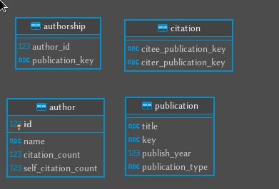

# DBLP parser

This script parses the DBLP database and feeds the data into a postgres database.

# Setup

### Installing dependencies

##### Postgres

[Follow the official documentation to download and install postgres](https://www.postgresql.org/)

##### Python and packages

- [Install python](https://www.python.org/)

- For installing packages some sort of virtual environment is recommended but hey, you do you!!

```
pip install -e requirements.txt
```

### Database

Before running this create the database and user, remove the curly brackets in the following

```
CREATE DATABASE {postgres_dbname};
CREATE USER {postgres_username} WITH PASSWORD {postgres_password};
GRANT ALL ON DATABASE {postgres_dbname} TO {postgres_username};
```

### Variables

Make a file `./src/variables.py`, define the following variables in it

- `folder` : The directory where the XML file recides
- `fileName` : The name of the XML file
- `postgres_dbname` : the name of the database which you used in the last section
- `postgres_username` : the user for the databse which you used in the last section
- `postgres_password` :  the password of the use which you used in the last section


# Running the script

I have included some other scripts which might be helpful in the context.


### Database test

To check if the script has access to the database is setup correctly.

```
python3 database_test.py
```

**NOTE: After you run the test, open the script and follow the instructions on top of the script for clean up.**

### Moving Data from XML to Postgres

```
python3 main.py
```

### Citation and self-citation data

TO fill in the citation and self-citation data.
```
python3 update_citation_counts.py
```

# UML of the postgres database


